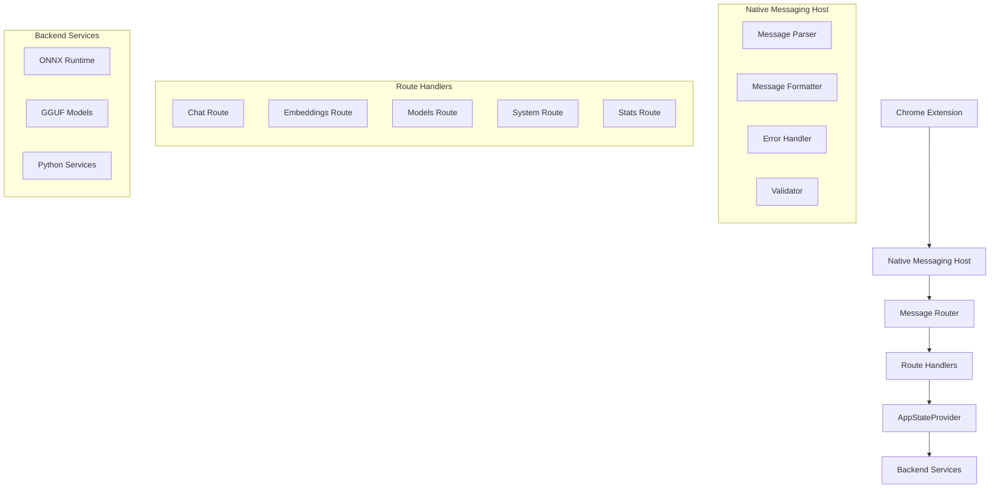

# Native Messaging Design Document

## Overview

The native messaging implementation provides a Chrome extension communication layer that mirrors the existing API and WebRTC crates with 100% functional parity. The design follows Chrome's native messaging protocol specification while maintaining identical architectural patterns, error handling, validation, and route organization as established in the TabAgent Rust ecosystem.

The implementation consists of a standalone native messaging host binary that communicates with Chrome extensions via stdin/stdout using length-prefixed JSON messages, routing requests through the same RouteHandler trait system used by API and WebRTC crates.

## Architecture

### High-Level Architecture



### Crate Structure

Following the established pattern from API and WebRTC crates:

```
Rust/native-messaging/
├── Cargo.toml
├── src/
│   ├── lib.rs              # Public API and main entry point
│   ├── main.rs             # Binary entry point for native messaging host
│   ├── config.rs           # Configuration management
│   ├── error.rs            # Error types and handling
│   ├── traits.rs           # Trait definitions (mirrors API traits)
│   ├── route_trait.rs      # Route handler trait system
│   ├── protocol.rs         # Chrome native messaging protocol implementation
│   ├── router.rs           # Message routing and dispatch
│   ├── middleware.rs       # Request/response middleware
│   └── routes/             # Individual route handlers
│       ├── mod.rs
│       ├── health.rs
│       ├── chat.rs
│       ├── embeddings.rs
│       ├── models.rs
│       ├── sessions.rs
│       ├── rag.rs
│       ├── rerank.rs
│       ├── system.rs
│       ├── generation.rs
│       ├── params.rs
│       ├── stats.rs
│       ├── resources.rs
│       ├── management.rs
│       └── rag_extended.rs
```

## Components and Interfaces

### 1. Native Messaging Protocol Handler

**Purpose**: Implements Chrome's native messaging protocol specification

**Key Components**:
- `MessageParser`: Handles length-prefixed JSON message parsing from stdin
- `MessageFormatter`: Formats responses as length-prefixed JSON to stdout
- `ProtocolError`: Handles protocol-level errors and malformed messages

**Interface**:
```rust
pub struct NativeMessagingProtocol;

impl NativeMessagingProtocol {
    pub async fn read_message() -> Result<serde_json::Value, ProtocolError>;
    pub async fn write_message(message: &serde_json::Value) -> Result<(), ProtocolError>;
    pub fn validate_message_format(message: &serde_json::Value) -> Result<(), ProtocolError>;
}
```

### 2. Route Handler System

**Purpose**: Implements identical route handling patterns as API/WebRTC crates

**Key Components**:
- `NativeMessagingRoute` trait: Mirrors `RouteHandler` and `DataChannelRoute` traits
- Route implementations for all 36+ endpoints
- Compile-time enforcement via macros

**Interface**:
```rust
#[async_trait]
pub trait NativeMessagingRoute: Send + Sync + 'static {
    type Request: DeserializeOwned + Debug + Send + Sync;
    type Response: Serialize + Debug + Send + Sync;
    
    fn metadata() -> RouteMetadata;
    async fn validate_request(req: &Self::Request) -> NativeMessagingResult<()>;
    async fn handle<S>(req: Self::Request, state: &S) -> NativeMessagingResult<Self::Response>
    where S: AppStateProvider + Send + Sync;
    fn test_cases() -> Vec<TestCase<Self::Request, Self::Response>>;
}
```

### 3. Message Router

**Purpose**: Routes incoming messages to appropriate route handlers

**Key Components**:
- Route registration and dispatch
- Request/response transformation
- Error handling and logging

**Interface**:
```rust
pub struct MessageRouter {
    routes: HashMap<String, Box<dyn RouteDispatcher>>,
    state: Arc<dyn AppStateProvider>,
}

impl MessageRouter {
    pub fn new(state: Arc<dyn AppStateProvider>) -> Self;
    pub fn register_route<R: NativeMessagingRoute>(&mut self);
    pub async fn dispatch(&self, message: serde_json::Value) -> NativeMessagingResult<serde_json::Value>;
}
```

### 4. Error Handling System

**Purpose**: Provides consistent error handling matching API/WebRTC patterns

**Key Components**:
- `NativeMessagingError`: Error type hierarchy
- Error conversion from API/WebRTC errors
- Protocol-compliant error responses

**Interface**:
```rust
#[derive(Debug, thiserror::Error)]
pub enum NativeMessagingError {
    #[error("Protocol error: {0}")]
    Protocol(String),
    
    #[error("Validation error in field '{field}': {message}")]
    ValidationError { field: String, message: String },
    
    #[error("Route not found: {route}")]
    RouteNotFound { route: String },
    
    #[error("Internal error: {0}")]
    Internal(String),
    
    #[error("Backend error: {0}")]
    Backend(#[from] anyhow::Error),
}
```

## Data Models

### Message Format

Following Chrome's native messaging specification:

```rust
// Incoming message from Chrome extension
#[derive(Debug, Deserialize)]
pub struct IncomingMessage {
    pub route: String,           // Route identifier (e.g., "chat", "embeddings")
    pub request_id: String,      // Client-generated request ID
    pub payload: serde_json::Value, // Route-specific request data
}

// Outgoing response to Chrome extension
#[derive(Debug, Serialize)]
pub struct OutgoingMessage {
    pub request_id: String,      // Echo back client request ID
    pub success: bool,           // Indicates success/failure
    pub data: Option<serde_json::Value>, // Response data (if successful)
    pub error: Option<ErrorResponse>,    // Error details (if failed)
}

#[derive(Debug, Serialize)]
pub struct ErrorResponse {
    pub code: String,            // Error code
    pub message: String,         // Human-readable error message
    pub details: Option<serde_json::Value>, // Additional error context
}
```

### Route Metadata

Identical to API/WebRTC route metadata:

```rust
#[derive(Debug, Clone)]
pub struct RouteMetadata {
    pub route_id: &'static str,
    pub tags: &'static [&'static str],
    pub description: &'static str,
    pub openai_compatible: bool,
    pub idempotent: bool,
    pub requires_auth: bool,
    pub rate_limit_tier: Option<&'static str>,
    pub supports_streaming: bool,
    pub supports_binary: bool,
}
```

## Error Handling

### Error Hierarchy

The error handling system mirrors the API and WebRTC crates:

1. **Protocol Errors**: Malformed messages, invalid JSON, length mismatches
2. **Validation Errors**: Invalid request parameters, missing required fields
3. **Route Errors**: Unknown routes, unsupported operations
4. **Backend Errors**: Service failures, model errors, resource exhaustion
5. **Internal Errors**: Unexpected system failures

### Error Response Format

All errors are returned in a consistent format:

```json
{
  "request_id": "client-generated-id",
  "success": false,
  "error": {
    "code": "VALIDATION_ERROR",
    "message": "temperature must be between 0.0 and 2.0, got 3.0",
    "details": {
      "field": "temperature",
      "value": 3.0,
      "constraints": { "min": 0.0, "max": 2.0 }
    }
  }
}
```

### Error Conversion

Errors from backend services are converted to native messaging format:

```rust
impl From<ApiError> for NativeMessagingError {
    fn from(err: ApiError) -> Self {
        match err {
            ApiError::ValidationError { field, message, .. } => {
                NativeMessagingError::ValidationError { field, message }
            },
            ApiError::BadRequest(msg) => NativeMessagingError::Protocol(msg),
            ApiError::Internal(msg) => NativeMessagingError::Internal(msg),
            _ => NativeMessagingError::Backend(err.into()),
        }
    }
}
```

## Testing Strategy

### Unit Testing

Each route handler includes comprehensive unit tests following the established pattern:

```rust
#[cfg(test)]
mod tests {
    use super::*;
    
    #[tokio::test]
    async fn test_chat_route_validation() {
        let req = ChatCompletionRequest {
            model: "".to_string(), // Invalid: empty model
            messages: vec![],
        };
        
        let result = ChatRoute::validate_request(&req).await;
        assert!(result.is_err());
        assert!(matches!(result.unwrap_err(), 
            NativeMessagingError::ValidationError { .. }));
    }
    
    #[tokio::test]
    async fn test_chat_route_success() {
        let mock_state = MockAppStateProvider::new();
        let req = ChatCompletionRequest {
            model: "gpt-3.5-turbo".to_string(),
            messages: vec![ChatMessage {
                role: "user".to_string(),
                content: "Hello".to_string(),
                name: None,
            }],
            temperature: Some(0.7),
            max_tokens: Some(100),
            top_p: None,
            stop: None,
            stream: false,
        };
        
        let response = ChatRoute::handle(req, &mock_state).await.unwrap();
        assert!(!response.choices.is_empty());
        assert_eq!(response.object, "chat.completion");
    }
}
```

### Integration Testing

Protocol-level integration tests verify Chrome native messaging compliance:

```rust
#[tokio::test]
async fn test_protocol_message_parsing() {
    let message = r#"{"route":"health","request_id":"test-123","payload":{}}"#;
    let length = (message.len() as u32).to_le_bytes();
    
    let mut input = Vec::new();
    input.extend_from_slice(&length);
    input.extend_from_slice(message.as_bytes());
    
    let parsed = NativeMessagingProtocol::parse_message(&input).unwrap();
    assert_eq!(parsed.route, "health");
    assert_eq!(parsed.request_id, "test-123");
}
```

### End-to-End Testing

Full workflow tests simulate Chrome extension communication:

```rust
#[tokio::test]
async fn test_full_chat_workflow() {
    let host = NativeMessagingHost::new(mock_state()).await;
    
    let request = IncomingMessage {
        route: "chat".to_string(),
        request_id: "test-456".to_string(),
        payload: serde_json::json!({
            "model": "gpt-3.5-turbo",
            "messages": [{"role": "user", "content": "Hello"}]
        }),
    };
    
    let response = host.process_message(request).await.unwrap();
    assert!(response.success);
    assert_eq!(response.request_id, "test-456");
    assert!(response.data.is_some());
}
```

### Performance Testing

Load testing ensures the native messaging host can handle concurrent requests:

```rust
#[tokio::test]
async fn test_concurrent_requests() {
    let host = Arc::new(NativeMessagingHost::new(mock_state()).await);
    let mut handles = Vec::new();
    
    for i in 0..100 {
        let host_clone = host.clone();
        let handle = tokio::spawn(async move {
            let request = create_test_request(i);
            host_clone.process_message(request).await
        });
        handles.push(handle);
    }
    
    let results = futures::future::join_all(handles).await;
    assert!(results.iter().all(|r| r.is_ok()));
}
```

## Implementation Notes

### Chrome Native Messaging Protocol

The implementation strictly follows Chrome's specification:

1. **Message Format**: 4-byte little-endian length header + UTF-8 JSON payload
2. **Maximum Message Size**: 1MB (1,048,576 bytes)
3. **Bidirectional Communication**: Host can send messages to extension
4. **Connection Lifecycle**: Connection persists until extension or host terminates

### Route Handler Parity

Each route handler maintains identical functionality to its API/WebRTC counterpart:

1. **Request/Response Schemas**: Exact same data structures
2. **Validation Rules**: Identical parameter validation
3. **Error Handling**: Same error types and messages
4. **Business Logic**: Identical processing logic
5. **Performance Characteristics**: Similar response times and resource usage

### Streaming Support

For routes that support streaming (chat completions, generation):

1. **Protocol Extension**: Use multiple response messages with continuation tokens
2. **Backpressure Handling**: Implement flow control to prevent buffer overflow
3. **Error Recovery**: Handle mid-stream errors gracefully
4. **Resource Cleanup**: Ensure proper cleanup of streaming resources

### Security Considerations

1. **Origin Validation**: Verify Chrome extension origins
2. **Rate Limiting**: Implement same rate limiting as API endpoints
3. **Authentication**: Support same authentication mechanisms
4. **Audit Logging**: Log all requests for security monitoring
5. **Resource Limits**: Prevent resource exhaustion attacks

This design ensures the native messaging implementation provides complete functional parity with existing API and WebRTC implementations while maintaining the architectural standards and quality controls established in the TabAgent Rust ecosystem.